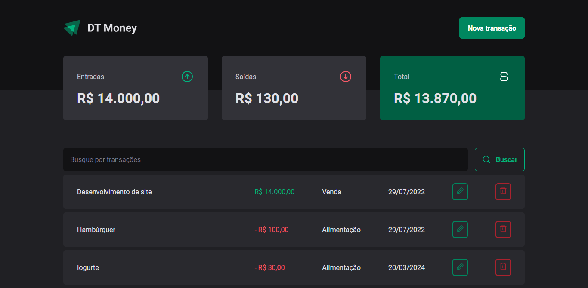

<h1 align="center">
  
</h1>

<p align="center">
  <a href="https://github.com/fernandogatto/" target="_blank">
    
  </a>

  

  
</p>

> Web application for money control.

## 🔗 Table of contents

- [Technologies](#technologies)
- [Installation](#installation)
- [Getting start](#start)
- [Project](#project)
- [Contribute](#contribute)

## 📌 Technologies <a name="technologies"/>

- [ESLint](https://eslint.org/)
- [Jest](https://jestjs.io/)
- [ReactJS](https://pt-br.reactjs.org/)
- [React Hook Form](https://www.react-hook-form.com/)
- [Radix UI](https://www.radix-ui.com/)
- [Styled Components](https://styled-components.com/)
- [Prettier](https://prettier.io/)
- [Testing Library](https://testing-library.com/)
- [Vite](https://vitejs.dev/)

## 📂 Installation <a name="installation"/>

First of all, it is important that you have installed [npm](https://www.npmjs.com/).

So, run this command in terminal to clone the project via HTTPS:

```bash
git clone https://github.com/fernandogatto/ignite-dt-money
```

SSH URLs provide access to a Git repository via SSH, a secure protocol. If you have a SSH key registered in your Github account, clone the project using this command:

```bash
git@github.com:fernandogatto/ignite-dt-money.git
```

**Install dependencies**

```bash
npm install
```

## 🚀 Getting start <a name="start"/>

Run the following command in order in terminal:

```bash
# Start the server
npm run dev
```

```bash
# Run the tests
npm run test
```

## 💻 Project <a name="project"/>

Dashboard:



## 👍 Contribute <a name="contribute"/>

- Fork this repository.
- Create a branch with your resource: `git checkout -b feature/my-feature`
- Submit changes: `git commit -m "feat: My new feature"`
- Push your branch: `git push origin feature/my-feature`

Build with 💙 by [Fernando Gatto](https://github.com/fernandogatto/).
